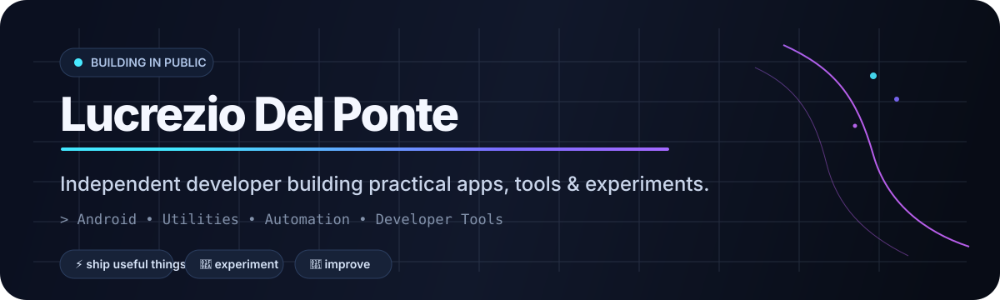
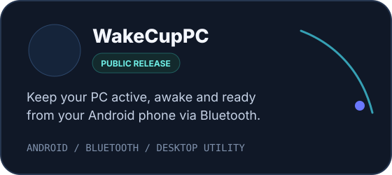
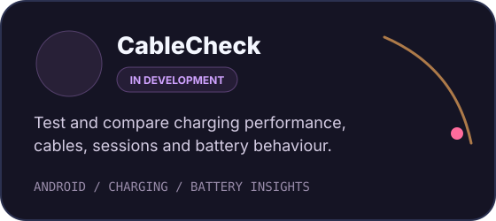

<div align="center">



<br/>

<a href="https://github.com/Lucrezio0987-Org"></a>
<a href="https://www.instagram.com/lucrezio0987_org/"></a>
<a href="https://www.producthunt.com/@lucrezio0987"></a>

</div>

<br/>

## ✦ Featured products

<table>
<tr>
<td width="50%" valign="top">

<a href="https://play.google.com/store/apps/details?id=com.lucrezio0987.hidautoinput2">
  
</a>

<br/>

**WakeCupPC** keeps your PC active, awake and ready from your Android phone using Bluetooth, schedules and direct controls.

**Status:** Google Play rollout  
**Platforms:** Android + PC workflow

<br/>

<a href="https://play.google.com/store/apps/details?id=com.lucrezio0987.hidautoinput2"></a>
<a href="https://github.com/Lucrezio0987-Org"></a>

</td>
<td width="50%" valign="top">



<br/>

**CableCheck** is an Android toolkit for understanding real charging performance across cables, sessions and devices through practical battery and charging insights.

**Status:** active development  
**Platform:** Android

<br/>


<a href="https://github.com/Lucrezio0987-Org"></a>

</td>
</tr>
</table>

<br/>

## ◇ Current focus

```text
01  WakeCupPC   →  Google Play rollout & product launch
02  CableCheck  →  charging analytics & testing experience
03  Labs        →  utilities, automation and new product experiments
```

I build products around small but real problems: repetitive actions, missing information, awkward workflows and things that should simply be easier.

<br/>

## ⚙︎ Build stack

<div align="center">


</div>

<br/>

## ↗ Releases, notes & updates

This profile is the **public index of what I build**.

| Where | What lives there |
|---|---|
| **GitHub Organization** | Products, public repositories and technical projects |
| **Google Play** | Android downloads and production releases |
| **GitHub Releases** | Versioned software releases and technical changelogs where applicable |
| **Product Hunt** | Public product launches |
| **Instagram** | Visual updates, previews and short demos |

As more products become public, this section will surface the most relevant releases and announcements.

<br/>

## ◎ Around the web

<div align="center">

<a href="https://github.com/Lucrezio0987-Org"></a>
<a href="https://www.instagram.com/lucrezio0987_org/"></a>
<a href="https://www.producthunt.com/@lucrezio0987"></a>

</div>

<br/>

<div align="center">

### Building useful software, one practical problem at a time.

<sub>Lucrezio Del Ponte · Independent developer & maker</sub>

</div>
